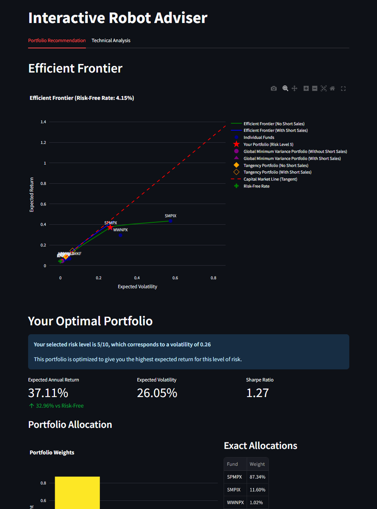

# Robot Adviser - Portfolio Optimization App

This repository contains a modern portfolio theory (MPT) implementation with an interactive Streamlit web application that helps users find their optimal investment portfolio based on their risk tolerance.



## Features

- **Risk Profiling**: Complete a comprehensive questionnaire to determine your risk tolerance or manually set your risk level
- **Efficient Frontier Visualization**: Interactive plot showing efficient frontiers with and without short sales
- **Portfolio Optimization**: Get an optimal portfolio allocation based on your risk profile
- **Technical Analysis**: View detailed metrics including mean returns, covariance matrix, and minimum variance portfolios

## How to Run

### Prerequisites

- Python 3.8+
- Required packages (see `requirements.txt`)

### Step 1: Install dependencies

```bash
pip install -r requirements.txt
```

### Step 2: Open calculation.ipynb and run all cells

Go through all cells in the notebook to:
1. Download historical stock data
2. Calculate mean returns
3. Calculate covariance matrix
4. Save the necessary files to the `data/` directory

### Step 3: Launch the Streamlit app

```bash
streamlit run app.py
```

The application will be available at http://localhost:8501

## How It Works

1. The app uses Modern Portfolio Theory to create an efficient frontier of optimal portfolios
2. Your risk profile (1-10) is mapped to a specific portfolio on the efficient frontier
3. Portfolio weights are optimized for maximum return at your specific risk level
4. The application shows key metrics (expected return, volatility, Sharpe ratio)

## Technical Details

The app demonstrates several key concepts from portfolio theory:
- Mean-variance optimization
- Efficient frontier calculation (with and without short sales)
- Capital Market Line
- Global Minimum Variance Portfolio
- Tangency Portfolio (maximum Sharpe ratio)

## Project Structure

- `app.py` - Main Streamlit application
- `calculation.ipynb` - Jupyter notebook for data preparation
- `data/` - Directory containing the prepared data files
- `requirements.txt` - Required Python packages